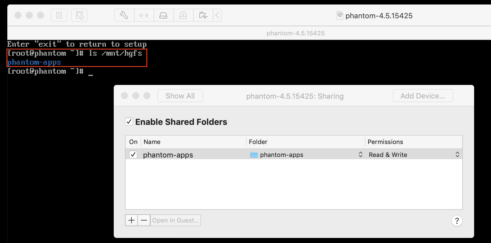

## Intro for Developers
When contributing to a new project, sometimes getting your development environment set-up just right can be tedious. This document will describe one (or more) ways to get your environment configured. This document describes the ways in which Splunk>Phantom's developers have their workstations configured.

**NOTE: This is not a guide on _how_ to develop Phantom apps (you can find that [here](https://my.phantom.us/4.5/docs/appdev/overview)), rather it represents how you might configure your workstation to allow for rapid code->deploy->test cycle.**

### Local Development with Virtualization and OVA
Many developers keep a local instance of Phantom running on a virtualization platform such as VMWare or VirtualBox. In this section, we'll look at a configuration using VMWare Fusion (Mac) and a local OVA.

1. Get a local Phantom instance running on your virtualization platform. 
1. Enable folder-sharing from your workstation to the Virtual Machine. This will enable you to write code with your favorite editor and not have to `scp` the files to the VM as you work on your project.
    
    For example, in the screenshot below we see a shared folder between the VMWare Host and the VM.

    

1. Verify that the shared folder is mounted on the guest VM. In my case, the shared folder is available under /mnt/hgfs

    

1. Now, on your host machine you can use the shared directory for your code repository and compile from there in the VM.

